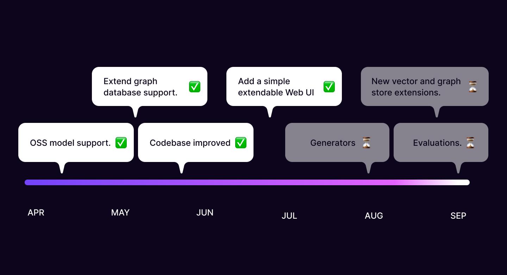
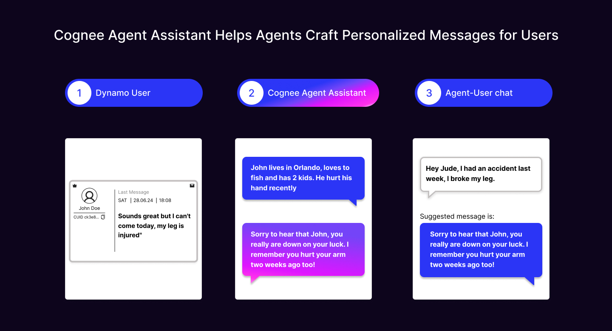

# Cognee - Recap

Over the past three months, we've been developing Cognee—a self-improving data storage system for AI applications and agents. Since our initial library release, we have:

- Add OSS model support
- Extend graph database support
- Improve the codebase
- Add a simple, extendable web UI

We are still working on adding evaluations. We’re also planning a library rewrite for better scalability, with many more vector and graph store extensions on the way.

## Future Directions

Instead of developing in isolation, we chose to collaborate with several design partners to build a solid foundation of practical examples of what works and what doesn’t.

Recently, we worked with our design partner Dynamo.fyi on one of the first production deployments of Cognee. We’ll summarize the results of this project in the following sections.

In previous integrations with keepi.ai and Luccid, we deployed Cognee on AWS, built a cognitive model, and provided a managed service. These initial integrations helped us iterate faster with the product and understand what we need to develop and build in the next iterations. 

As we iterated on the product and released a Python library, releasing it in production became a priority. As we imagined running cognee on our users' infrastructure, for our next step, we decided to work with Dynamo on deploying cognee on their cloud.

We took this approach deliberately because creating integrations and providing solutions on someone else's infrastructure is complex. It involves many considerations, such as cloud provider choices, permissions, and data handling. Questions about ingestion, security, and relevant concepts, such as guardrails, quickly follow.

## Helping Dynamo Interact With Users

Dynamo helps gaming companies interact with their user base. Agents communicate via messenger to offer bonuses and encourage participation in tournaments and other games. The company needed a personalization layer to enable agents to interact optimally with users, providing specific suggestions based on purchase activity, recent events, and more.

We were tasked with building a naive recommender system using LLMs to suggest optimal responses. This required a feature store containing relevant user-level information and data enriched with LLM-structured outputs. This data was then fed to Cognee to support agents with personalized messages and real-time analytics.

## From Naive RAG to GraphRAG

Upon arrival at Dynamo, we found a rudimentary agent support system connected to OpenAI with one templated query. Instead of building a GraphRAG, we needed to replicate the existing functionality and create an infrastructure layer for future evolution towards GraphRAG. 

GraphRAG would provide a semantic and personalization layer above the Firebase store where all customer data is located. However, this would only be useful if we had a system to release our agent support assistant to production.

Our initial work involved preparing a data layer, deployments, endpoints, and monitoring layers. Once we released the first version to production, our design partner started requesting features that necessitated a GraphRAG.

These features included timelines of recent vs. non-recent events, complex user enrichments, deterministic to non-deterministic data mapping provided by the LLM, complex logic creation, behavior analysis across sessions, and agent personality extraction.

These features will be implemented soon, thus allowing us to evaluate our basic RAG vs GraphRAG.

## Outcomes

In one month, we built, deployed, integrated, and tested a service that provided Dynamo agents with several new tools. These tools help agents analyze user transactions, suggest replies, and initiate conversations.

Here is a simplified interpretation of the flow:

We also ran evaluations comparing the old and new services using the open-source tool DeepEval for visualization. The metrics used for evaluation, with AI as the judge, were:

- Answer Relevancy: Measures the quality of the RAG pipeline's generator by evaluating how relevant the actual_output is compared to the provided input.
- Faithfulness: Measures the quality of the RAG pipeline's generator by evaluating whether the actual_output factually aligns with the contents of the retrieval_context.

## Results

The old service performed as follows:

The new service shows the following results on test cases on the user level, running on 55 manually generated questions based on previous User/Agent interactions: 

Since in both cases we had structured data extracted from a relational store and provided as context, we did not face Faithfulness issues. On the other hand, we significantly improved the baseline Answer Relevancy.

